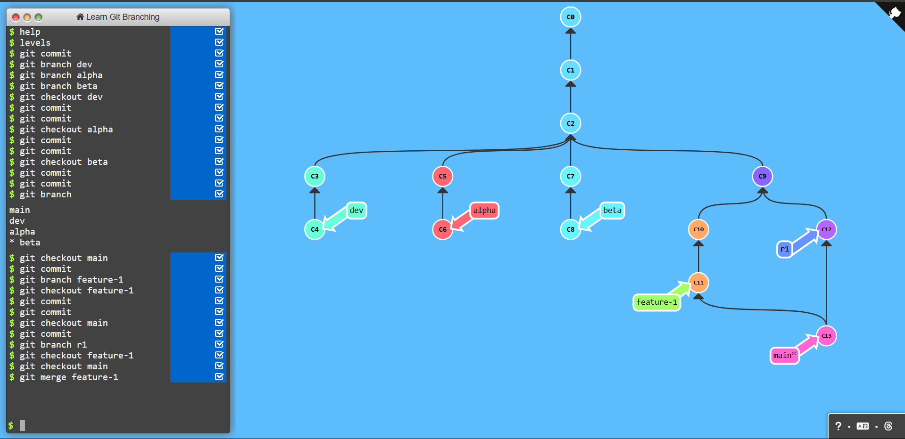
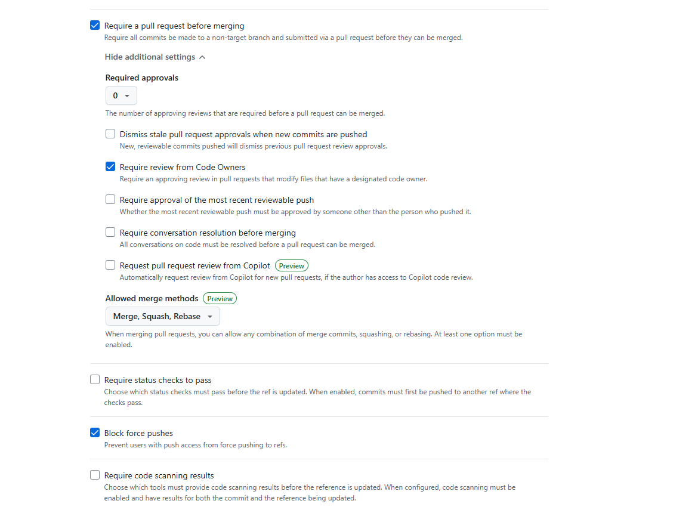
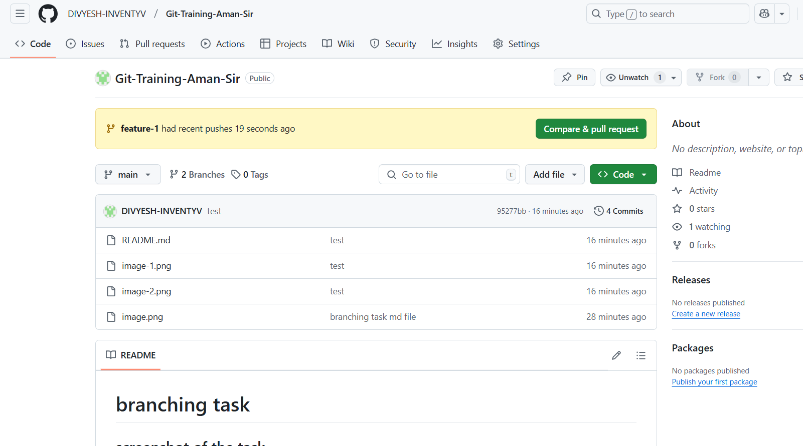
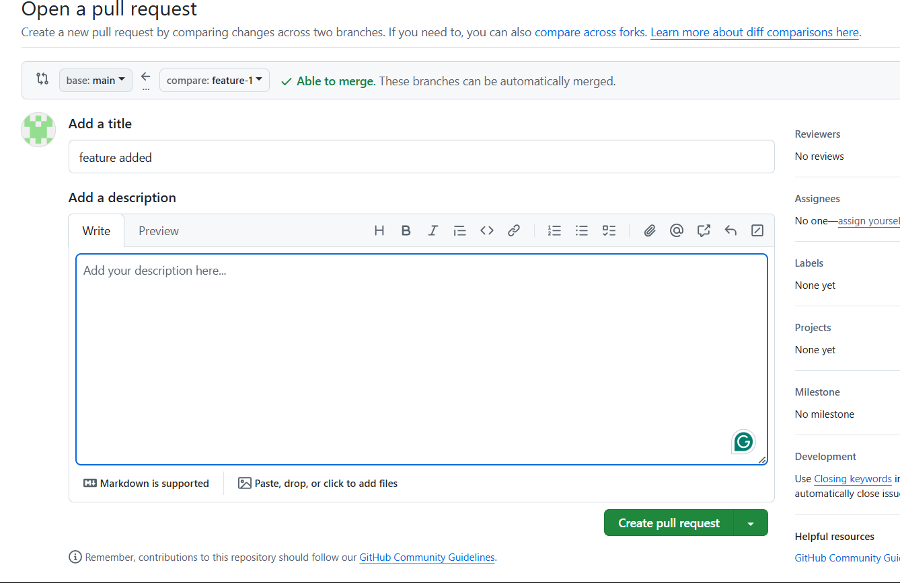
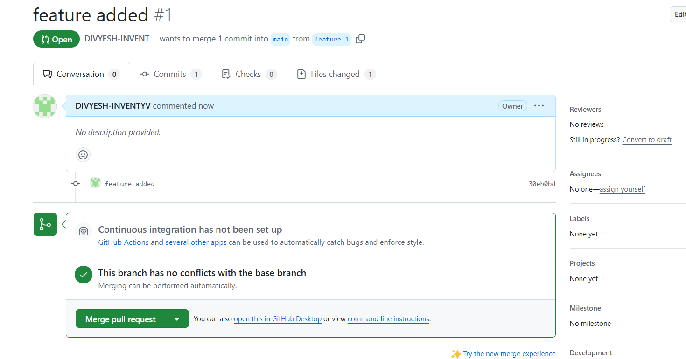
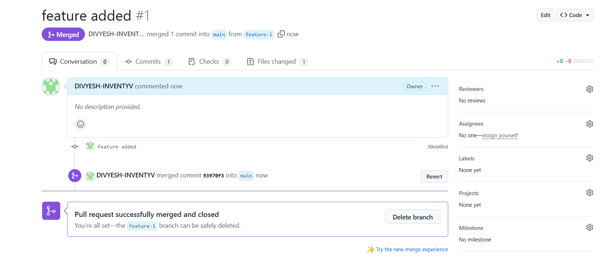

# branching task

## screenshot of the task



## Exlpaination

### made some initial commits in main branch

```bash
git commit
```

### made three branches alpha, beta, prod

```bash
git branch alpha
git branch beta
git branch prod
```

### made 2 commits in each branch ( one example is given here )

```bash
git checkout alpha
git commit
git commit
```

### made a feature-1 branch from main branch

```bash
git checkout main
git branch feature-1
git checkout feature-1
git commit
```

### made a hot-fix in main branch

```bash
git checkout main
git commit
```

### merge the feature-1 branch in main branch

```bash
git merge feature-1
```

# pull request task











